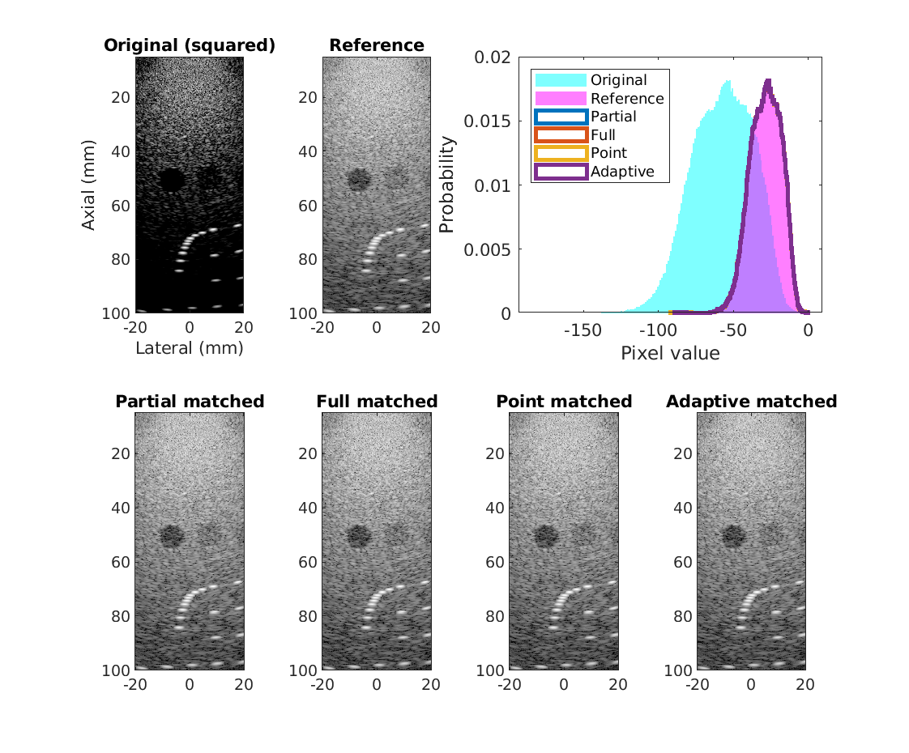
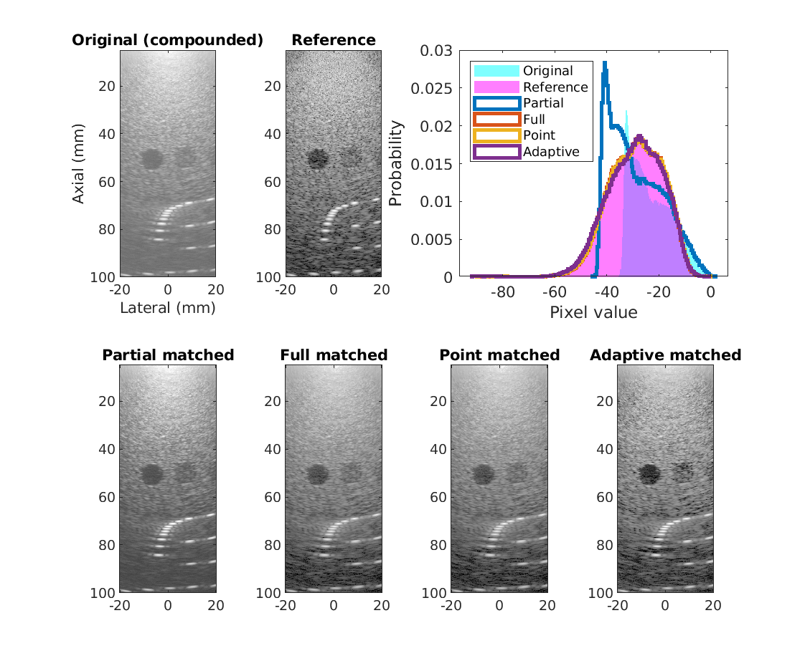
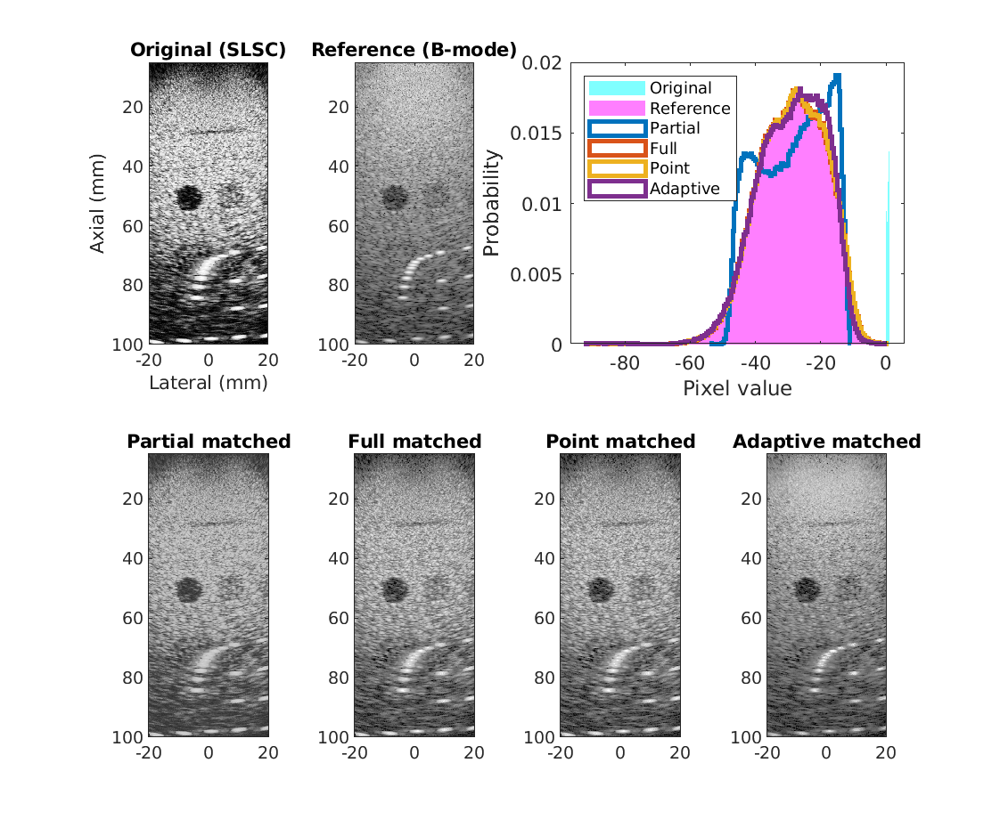
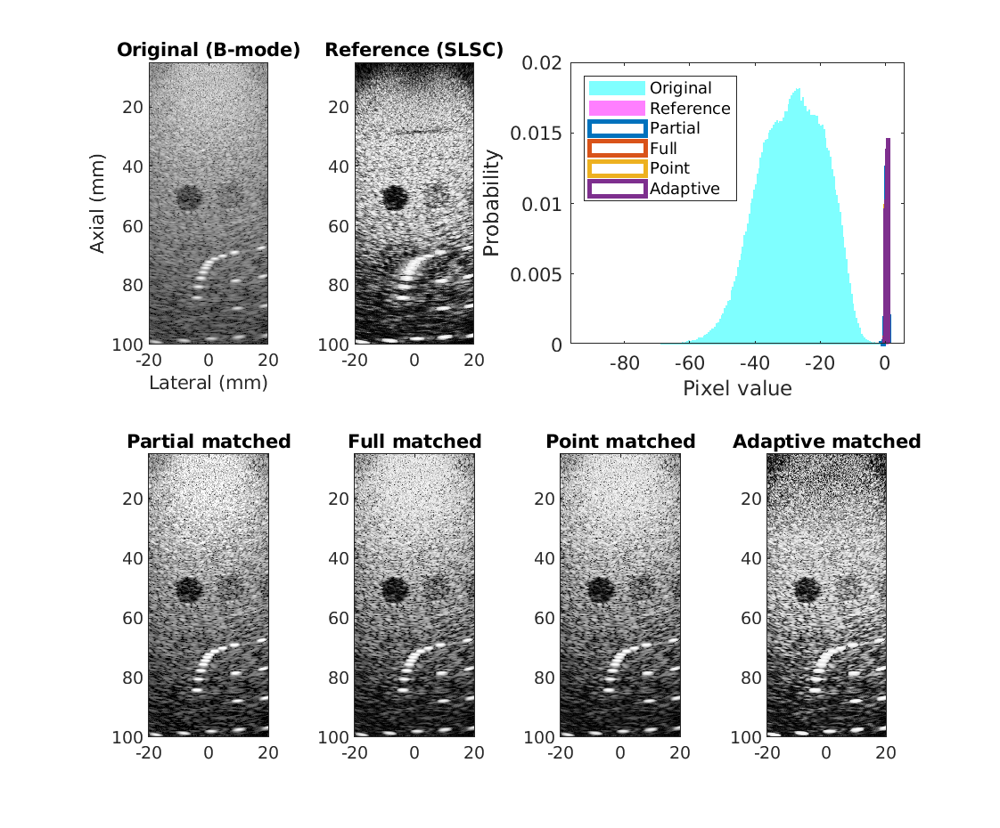
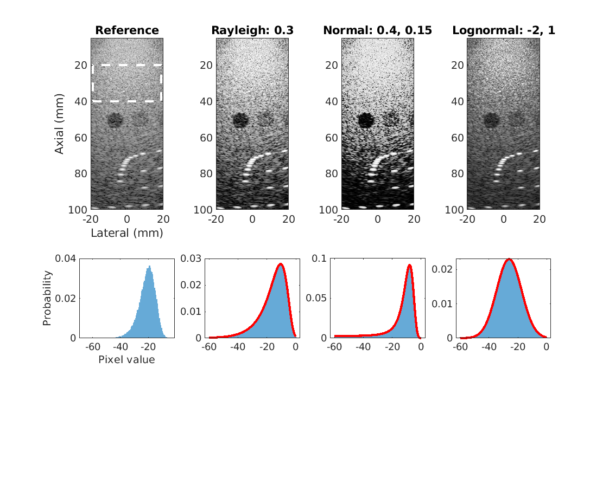

# Histogram matching for comparison of images with varying dynamic range and pixel distributions
Modify the histogram of a target image to match that of a reference image for improved comparison. This code provides several variations of matching with various uses and trade-offs. This code was developed in the context of ultrasound imaging, but could be applied more broadly.

This code accompanies the publication:

> Bottenus, N.; Byram, B.; Hyun, D.; "Histogram matching for visual ultrasound image comparison". *IEEE Transactions on Ultrasonics, Ferroelectrics, and Frequency Control*, (accepted)

You can reference a static version of this code by its DOI number:

If you use the code for research, please cite the above papers as appropriate.

## Methods

* Full: Full histogram matching using the CDF of both images
* Partial: Mean and variance matching
* Analytic: Full histogram matching using a reference CDF
* Adaptive: Full histogram matching using blocks within the image and interpolating the result
* Adaptive_all: Full histogram matching of a neighborhood around every pixel
* Point: Point-wise rank-order matching for an exact histogram match

"Full", "Partial", and "Analytic" can be run using an ROI for reference rather than the full image

## Demonstrations included

Under the [demo](demo) folder, you can find sample data and code for the following:

1. Square-law detector (intensity signal, or approximately squaring of pixel values before log compression) matched to B-mode

Because the data is approximately the B-mode with a linear transformation (squared in pixel space = doubling after log compression), all methods closely match the reference image

2. Receive spatial compounding matched to B-mode

The compounded image has a higher mean pixel value than the reference image and less dynamic range on the dark end of the histogram, making it appear washed out. Shifting the spectrum down restores some visual contrast and stretching the lower end of the distribution especially restores texture at the bottom of the image. Adaptive matching stretches texture separately throughout regions of the image, increasing apparent contrast of the lesions relative to the reference image. The same would be true with full matching and an ROI selected in only the speckle background.

3. Short-lag spatial coherence (SLSC) matched to B-mode

The SLSC image and B-mode images initally have different display dynamic ranges - SLSC is limited between 0 and 1. All matching methods put the SLSC image onto the same display dynamic range as the B-mode and much better match the overall appearance of the image, highlighting differences in texture, lesion visibility, and point target size.

4. Bmode matched to SLSC

The matching methods put the B-mode onto the SLSC dynamic range, more closely imitating the high-contrast appearance of the SLSC image.

5. B-mode data matched to various analytic distributions

A region of the speckle background (expected to be Log-Rayleigh distributed) is used to find a transformation to three different analytic distributions. When applied to the entire image, these provide drastically different appearances.
